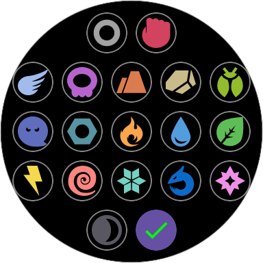
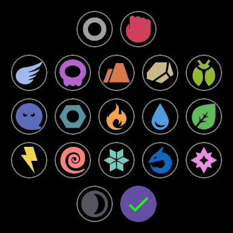
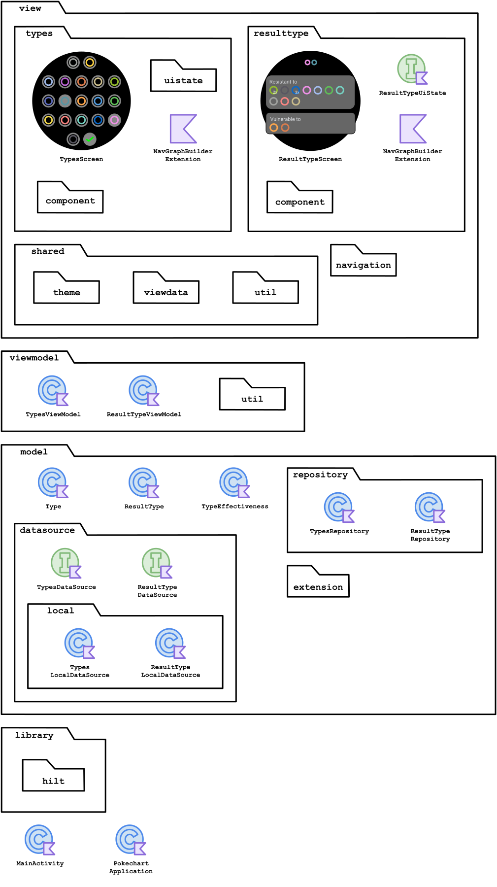

<h1 align="center">
   
  Pokechart
</h1>

  <strong>Compare types to check their vulnerabilities, resistances, and more.</strong> 
  Input the types, and the app will return the combined vulnerabilities and resistances.

- [Use Cases](#use-cases)
- [Technologies](#technologies)
- [Structure](#structure)
- [Diagrams](#diagrams)
  - [Package `io.schiar.pokechart`](#package-ioschiarpokechart)
- [Future Tasks](#future-tasks)

## Use Case

|&nbsp;&nbsp;&nbsp;&nbsp;&nbsp;&nbsp;&nbsp;&nbsp;&nbsp;&nbsp;&nbsp;&nbsp;&nbsp;&nbsp;&nbsp;&nbsp;&nbsp;&nbsp;&nbsp;&nbsp;&nbsp;&nbsp;&nbsp;&nbsp;&nbsp;&nbsp;&nbsp;&nbsp;&nbsp;&nbsp;&nbsp;&nbsp;&nbsp;&nbsp;&nbsp;&nbsp;&nbsp;&nbsp;&nbsp;&nbsp;Screenshot&nbsp;&nbsp;&nbsp;&nbsp;&nbsp;&nbsp;&nbsp;&nbsp;&nbsp;&nbsp;&nbsp;&nbsp;&nbsp;&nbsp;&nbsp;&nbsp;&nbsp;&nbsp;&nbsp;&nbsp;&nbsp;&nbsp;&nbsp;&nbsp;&nbsp;&nbsp;&nbsp;&nbsp;&nbsp;&nbsp;&nbsp;&nbsp;&nbsp;&nbsp;&nbsp;&nbsp;&nbsp;&nbsp;&nbsp;&nbsp;|&nbsp;&nbsp;&nbsp;&nbsp;&nbsp;&nbsp;&nbsp;&nbsp;&nbsp;&nbsp;&nbsp;&nbsp;&nbsp;&nbsp;&nbsp;&nbsp;&nbsp;&nbsp;&nbsp;&nbsp;Description&nbsp;&nbsp;&nbsp;&nbsp;&nbsp;&nbsp;&nbsp;&nbsp;&nbsp;&nbsp;&nbsp;&nbsp;&nbsp;&nbsp;&nbsp;&nbsp;&nbsp;&nbsp;&nbsp;&nbsp;|
|:-:|:-:|
||This is what the app looks like when you open it. To input the types, select them by pressing each one, and then click on the last button at the bottom.|
||You can select a single type. When only one type is selected, its strengths and weaknesses are also displayed, used for attacks from that type.|
||You can also select more than one type, allowing you to check the resistance and vulnerability types for a Pokémon with 2 types.|

# Technologies
|Technology|Purpose|
|:-:|:-:|
| [Jetpack Compose](https://developer.android.com/jetpack/compose)|Design UI|

## Structure
  Please check [my other project](https://github.com/giovanischiar/fridgnet?tab=readme-ov-file#structure) to learn more about the notation I used to create the diagrams in this project.

## Diagrams

### Package `io.schiar.pokechart`
  This diagram shows all the packages the application has, along with their structures. Some packages are simplified, while others are more detailed.
  <picture>
    <source media="(prefers-color-scheme: dark)" srcset="./readme-res/diagrams/dark/io-schiar-pokechart-structure-diagram.dark.svg">
    
  </picture>

## Future Tasks
  - Create an Icon.
  - Change the name.
  - Create a [tile](https://developer.android.com/training/wearables/tiles) to easily  access the application.
  - Publish on the store.

