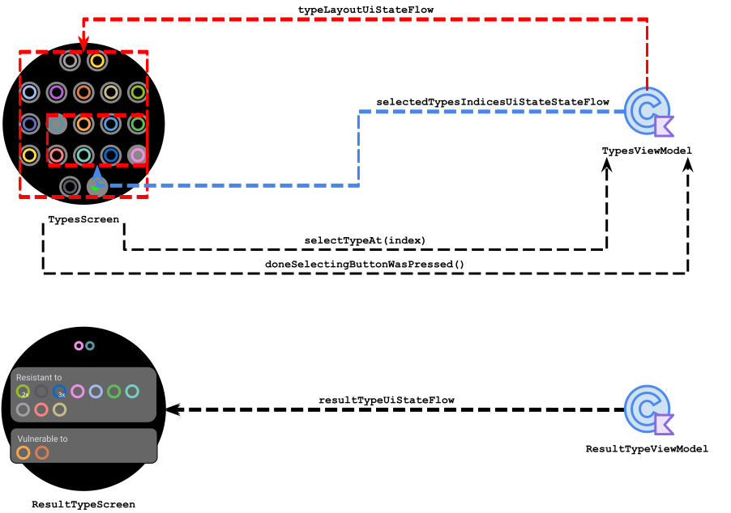
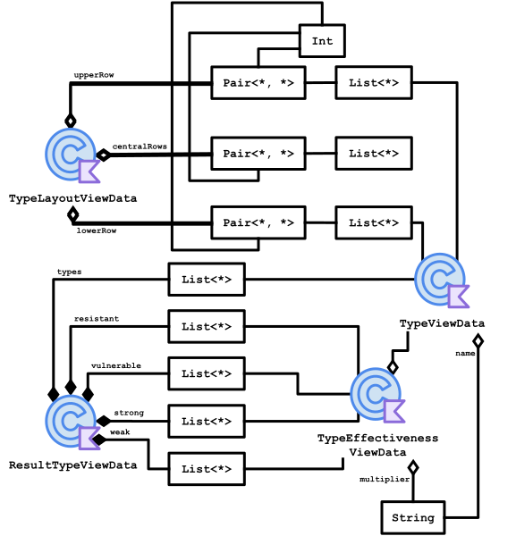
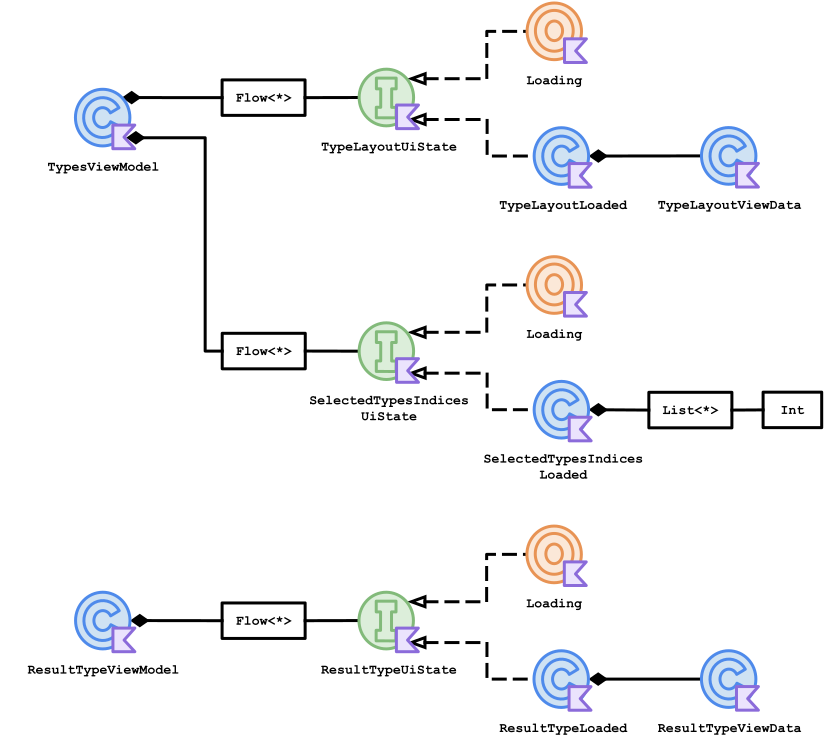
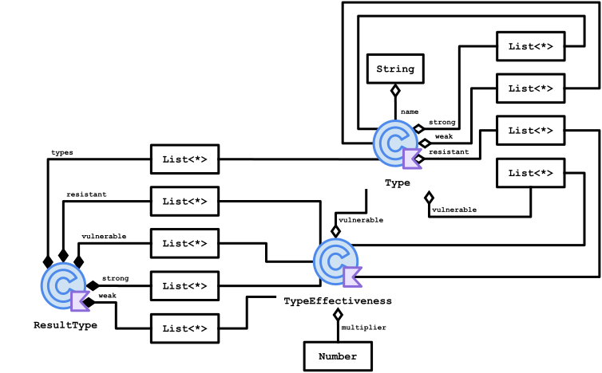
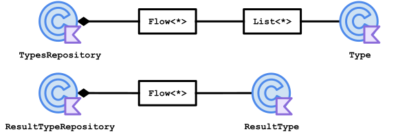

<h1 align="center">
   
  Pokechart
</h1>

  <strong>Compare types to check their vulnerabilities, resistances, and more.</strong> 
  Input the types, and the app will return the combined vulnerabilities and resistances.

- [Use Cases](#use-cases)
- [Technologies](#technologies)
- [Structure](#structure)
- [Diagrams](#diagrams)
  - [Package `io.schiar.pokechart`](#package-ioschiarpokechart)
  - [Package `view` and `viewmodel`](#package-view-and-viewmodel)
  - [Package `view.viewdata`](#package-viewviewdata)
  - [Package `viewmodel` and `view.viewdata`](#package-viewmodel-and-viewviewdata)
  - [Package `viewmodel` and `model.repository`](#package-viewmodel-and-modelrepository)
  - [Package `model`](#package-model)
  - [Package `model.repository` and `model`](#package-modelrepository-and-model)
- [Future Tasks](#future-tasks)

## Use Case

|&nbsp;&nbsp;&nbsp;&nbsp;&nbsp;&nbsp;&nbsp;&nbsp;&nbsp;&nbsp;&nbsp;&nbsp;&nbsp;&nbsp;&nbsp;&nbsp;&nbsp;&nbsp;&nbsp;&nbsp;&nbsp;&nbsp;&nbsp;&nbsp;&nbsp;&nbsp;&nbsp;&nbsp;&nbsp;&nbsp;&nbsp;&nbsp;&nbsp;&nbsp;&nbsp;&nbsp;&nbsp;&nbsp;&nbsp;&nbsp;Screenshot&nbsp;&nbsp;&nbsp;&nbsp;&nbsp;&nbsp;&nbsp;&nbsp;&nbsp;&nbsp;&nbsp;&nbsp;&nbsp;&nbsp;&nbsp;&nbsp;&nbsp;&nbsp;&nbsp;&nbsp;&nbsp;&nbsp;&nbsp;&nbsp;&nbsp;&nbsp;&nbsp;&nbsp;&nbsp;&nbsp;&nbsp;&nbsp;&nbsp;&nbsp;&nbsp;&nbsp;&nbsp;&nbsp;&nbsp;&nbsp;|&nbsp;&nbsp;&nbsp;&nbsp;&nbsp;&nbsp;&nbsp;&nbsp;&nbsp;&nbsp;&nbsp;&nbsp;&nbsp;&nbsp;&nbsp;&nbsp;&nbsp;&nbsp;&nbsp;&nbsp;Description&nbsp;&nbsp;&nbsp;&nbsp;&nbsp;&nbsp;&nbsp;&nbsp;&nbsp;&nbsp;&nbsp;&nbsp;&nbsp;&nbsp;&nbsp;&nbsp;&nbsp;&nbsp;&nbsp;&nbsp;|
|:-:|:-:|
||This is what the app looks like when you open it. To input the types, select them by pressing each one, and then click on the last button at the bottom.|
||You can select a single type. When only one type is selected, its strengths and weaknesses are also displayed, used for attacks from that type.|
||You can also select more than one type, allowing you to check the resistance and vulnerability types for a Pokémon with 2 types.|

# Technologies
|Technology|Purpose|
|:-:|:-:|
| [Jetpack Compose](https://developer.android.com/jetpack/compose)|Design UI|

## Structure
  Please check [my other project](https://github.com/giovanischiar/fridgnet?tab=readme-ov-file#structure) to learn more about the notation I used to create the diagrams in this project.

## Diagrams

### Package `io.schiar.pokechart`
  This diagram shows all the packages the application has, along with their structures. Some packages are simplified, while others are more detailed.
  <picture>
    <source media="(prefers-color-scheme: dark)" srcset="./readme-res/diagrams/dark/io-schiar-pokechart-structure-diagram.dark.svg">
    
  </picture>

### Package `view` and `viewmodel`
  These diagrams illustrate the relationship between screens from `view` and `viewmodel` classes. The arrows from the View Models represent View Data objects (classes that hold all the necessary data for the view to display), primitives, or collections encapsulated by [State Flows](https://kotlinlang.org/api/kotlinx.coroutines/kotlinx-coroutines-core/kotlinx.coroutines.flow/-state-flow/), which are classes that encapsulate data streams. Every update in the View Data triggers the State Flow to emit these new values to the `view`, and the view updates automatically. Typically, the methods called from screens in `view` to classes in `viewmodel` trigger these changes, as represented in the diagram below by arrows from the `view` screens to `viewmodel` classes.

  <picture>
    <source media="(prefers-color-scheme: dark)" srcset="./readme-res/diagrams/dark/view-viewmodel-diagram.dark.svg">
    
  </picture>

### Package `view.viewdata`
  View Datas are classes that hold all the data the `view` needs to present. They are created from `model` classes and served by View Models to the `view`. This diagram represents all the associations among the classes in the `view.viewdata`.

<picture>
  <source media="(prefers-color-scheme: dark)" srcset="./readme-res/diagrams/dark/viewdata-diagram.dark.svg">
  
</picture>

### Package `viewmodel` and `view.viewdata`
  View Models serve the `view` with objects made from `view.viewdata` classes, collections, or primitive objects encapsulated by State Flows. This diagram represents all the associations among the classes in `viewmodel` and `view.viewdata`.

<picture>
  <source media="(prefers-color-scheme: dark)" srcset="./readme-res/diagrams/dark/viewmodel-viewdata-diagram.dark.svg">
  
</picture>

### Package `viewmodel` and `model.repository`
  View Models also serve as a [façade](https://en.wikipedia.org/wiki/Facade_pattern), triggering methods in `model.repository` classes. This diagram shows that each View Model has its own repository class and illustrates all methods each View Model calls, represented by arrows from View Models to Repositories.

<picture>
  <source media="(prefers-color-scheme: dark)" srcset="./readme-res/diagrams/dark/viewmodel-repository-diagram.dark.svg">
  
</picture>

### Package `model`
  Model classes handle the logic of the application. This diagram represents all the associations among the classes in the `model`.

<picture>
  <source media="(prefers-color-scheme: dark)" srcset="./readme-res/diagrams/dark/model-diagram.dark.svg">
  
</picture>

### Package `model.repository` and `model`
  These diagrams represent all the associations among the classes in `model.repository` and `model`.

<picture>
  <source media="(prefers-color-scheme: dark)" srcset="./readme-res/diagrams/dark/repository-model-diagram.dark.svg">
  
</picture>

## Future Tasks
  - Create an Icon.
  - Change the name.
  - Create a [tile](https://developer.android.com/training/wearables/tiles) to easily  access the application.
  - Publish on the store.

